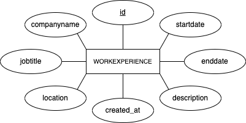

#  📌Laboration 2 – REST Webbtjänst (Backend)

## 🧾 Beskrivning

Detta repository innehåller del 1 av Laboration 2 i kursen Backend-baserad webbutveckling.
Uppgiften går ut på att skapa en REST-baserad webbtjänst med hjälp av Node.js och Express, kopplad till en relationsdatabas.

Webbtjänsten hanterar arbetserfarenheter och möjliggör fullständig CRUD-funktionalitet.

---

## 🎯 Syfte

Syftet med uppgiften är att:

- Förstå hur webbtjänster fungerar
- Skapa ett REST API med Node.js och Express
- Arbeta med en relationsdatabas
- Returnera och hantera data i JSON-format

---

## ⚙️ Tekniker

Projektet använder:

- Node.js
- Express
- PostgreSQL
- JavaScript
- Git & GitHub

---

## 🗄️ Databasstruktur

Applikationen använder en PostgreSQL-databas med tabellen `workexperience`.


### Tabell: `workexperience`

| Fält         | Typ           | Beskrivning                            |
|--------------|---------------|----------------------------------------|
| id           | SERIAL        | Primärnyckel, autoinkrement            |
| companyname  | VARCHAR(255)  | Företagsnamn                           |
| jobtitle     | VARCHAR(255)  | Jobbtitel                              |
| location     | VARCHAR(255)  | Plats                                  |
| startdate    | DATE          | Startdatum                             |
| enddate      | DATE          | Slutdatum                              |
| description  | TEXT          | Beskrivning                            |
| created_at   | TIMESTAMP     | Tidpunkt då posten skapades            |


---

## 🔁 Funktionalitet (CRUD)

Webbtjänsten stödjer följande operationer:

- GET – Hämtar poster
- POST – Skapa ny post
- PUT – Uppdatera post
- DELETE – Ta bort post

Alla svar returneras i JSON-format.

---

## 📡 API-användning

| Metod | Endpoint                  | Beskrivning                          |
|------|--------------------------|--------------------------------------|
| GET  | /workexperience          | Hämtar alla poster                   |
| GET  | /workexperience/:id      | Hämtar en specifik post              |
| POST | /workexperience          | Skapar en ny post                    |
| PUT  | /workexperience/:id      | Uppdaterar en befintlig post         |
| DELETE | /workexperience/:id    | Raderar en post                      |


### Exempel på objekt

Ett objekt från databasen returneras/skickas som JSON med följande struktur:

```json
{
  "companyname": "Malmaskolan",
  "jobtitle": "Elevassistent",
  "location": "Malmköping",
  "startdate": "2019-01-01",
  "enddate": "2019-12-31",
  "description": "Stöttade elever i behov av extra stöd under lektioner."
}
```

---

## ✅ Validering

- Alla fält valideras innan lagring
- Tomma värden tillåts inte
- Tydliga felmeddelanden returneras vid felaktig input

---

## 🌍 CORS

Webbtjänsten stödjer Cross-Origin Requests (CORS) för att kunna användas från externa klienter (t.ex. frontend i del 2).

---

## 🚀 Installation & körning

1. Klona repositoryt:

```bash
git clone https://github.com/fredrikastjernlof/Lab2_Webbtjanst.git
```

2. Installera dependencies:

```bash
npm install
```

3. Skapa en `.env`-fil utifrån `.env.sample` och fyll i dina databasuppgifter.

4. Sätt upp databasen:

```bash
npm run install-db
```

Vid behov kan du återställa databasen:

```bash
npm run reset-db
```

5. Starta utvecklingsservern:

```bash
npm run dev
```

eller:

```bash
npm start
```
---

## 🛠️ Databasscript 

- install.js – skapar databastabellen
- reset.js – återställer databasen

---

## 🌐 Publicering 

Webbtjänsten är publicerad via Render:

[Öppna webbtjänsten](https://lab2-webbtjanst.onrender.com/)

---

## 🔗 Extern klient

Denna webbtjänst används av en frontend-applikation:

[Öppna Webbplatsen](https://lab2webbplats.netlify.app)

Frontend-applikationen använder denna webbtjänst via Fetch API för att hämta, skapa, uppdatera och radera data.

---

## 📊 ER-diagram 



---

## ✅🙌 Det här tar jag med mig från uppgiften 

- Större förståelse för hur REST API:er byggs med Express
- Hur man kopplar en Node.js-applikation till en relationsdatabas
- Hur CRUD-operationer implementeras
- Vikten av validering i backend för att skydda databasen